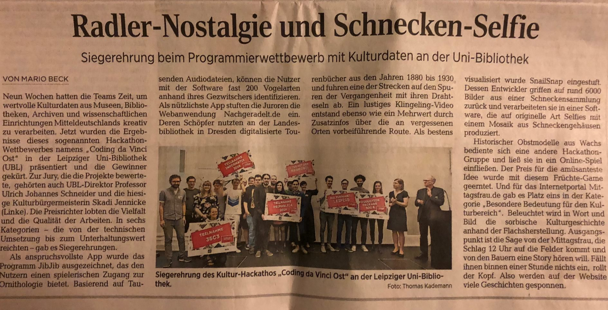

# dvmweb

Web application for Die Virtuelle Mittagsfrau ([Coding da Vinci 2018](https://codingdavinci.de/events/ost/)).

## We won a prize!

Out of compentition. Thanks!



## Static files

```shell
 $ tree -shd static
static
├── [4.0K]  cache
├── [4.0K]  css
├── [4.0K]  images
│   ├── [4.0K]  artifacts
│   ├── [4.0K]  landscapes
│   └── [4.0K]  people
└── [276K]  videos

7 directories
```

Images are categorized (we need three), videos are named `dvm-010203`, where
`01` names an artifact, `02` names a landscape, `03` a picture of people.

## Start server

```shell
$ make
go build -o dvmweb cmd/dvmweb/main.go

$ ./dvmweb
2019/02/21 13:11:16 starting server at http://0.0.0.0:3000
...
```

## More on the project

* Info, todo, data scraping and stuff: [https://github.com/sophiamanns/virtuelle_mittagsfrau](https://github.com/sophiamanns/virtuelle_mittagsfrau)
* Web application: [https://github.com/miku/dvmweb](https://github.com/miku/dvmweb)

