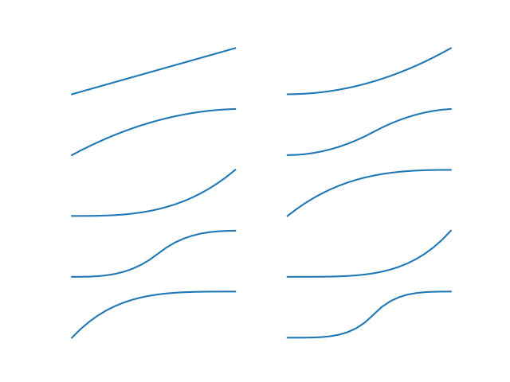

# Hacks


> **Flachsanbau und -verarbeitung**

> Der Flachs (auch Lein) gehört zu den ältesten Kulturpflanzen. In der
Hauswirtschaft war er für die Herstellung von Leinwand unentbehrlich. Auch in
der Lausitz wurde er in den vergangenen Jahrhunderten in recht großem Umfang
angebaut. Die aufwendige Beschäftigung mit dem Flachs, mit dem Weben und
Spinnen nahm viel Raum im Leben der ländlichen Bevölkerung ein und
widerspiegelt sich nicht nur im materiellen Erbe, wie in Geräten und Kleidung,
sondern auch im immateriellen Erbe wie dem Liedgut und in mythologischen
Vorstellungen (Sage von der Mittagsfrau). Die Spinnstuben waren ein wichtiger
sozialer und kultureller Ort der Dorfgemeinschaft.  *Spinnen und Weben wie in
alten Zeiten* erfreut sich wieder einer gewissen Faszination. Darstellungen von
Flachsanbau und -verarbeitung sind ein beliebtes Thema musealer Präsentationen.
Im Gegensatz zu Gerätschaften als Museumsobjekt vermitteln Bilder einen
intensiveren Eindruck vom Gebrauch und der Arbeit.  Im Bildarchiv des
Sorbischen Instituts befinden sich zahlreiche Fotografien zum genannten Thema.
Oft sind auf ihnen Frauen bei der Arbeit zu sehen. Während die dargestellte
Arbeit einen zeitlichen Horizont vermittelt, sind die abgebildeten Frauen durch
ihre Tracht eindeutig in einer bestimmten Region der sorbischen Lausitz zu
verorten (um Hoyerswerda, Niederlausitz, Kirchspiel Schleife).

----

Most of the [data](https://speicherwolke.uni-leipzig.de/index.php/s/C99LbgXSSPdgFxV) was available, but we lacked some landscapes, which, after
some digging, we found at the [Deutsche
Fotothek](http://www.deutschefotothek.de/), an incredible source of historical
imagery (they send you [printed versions as
well](http://www.deutschefotothek.de/cms/gebuehren.xml)). We limited the images
by grepping for names like *Sabrodt*, *Seidewinkel*, *Hoyerswerda* and
[more](https://github.com/sophiamanns/virtuelle_mittagsfrau/blob/188c259e5bdde2239bdf6031f64e9c5d7d7d06d0/fotothek.go#L56-L70).

Interestingly, the metadata only contains a link to a thumbnail, but with a bit
of
[digging](https://github.com/sophiamanns/virtuelle_mittagsfrau/blob/188c259e5bdde2239bdf6031f64e9c5d7d7d06d0/dfdl.go#L56),
we could
[harvest](https://github.com/sophiamanns/virtuelle_mittagsfrau/blob/master/dfdl.go)
a nice set of pictures, which were manually [tagged](https://raw.githubusercontent.com/sophiamanns/virtuelle_mittagsfrau/master/data/Metadaten_mit_Tags.csv).

```python
In [8]: df = pd.read_csv("https://git.io/vhrG8")

In [9]: df["Tag"].value_counts()
Out[9]:
Mensch        49
Technik       48
Landschaft    12
Name: Tag, dtype: int64
```

A couple of other technical challanges that needed to be addressed: In order to work
without JavaScript the slot machine animation had to be created as a GIF. A gif
image is made up of frames. Each frame needs to be manually generated by moving each
of the three image strips by some sensible amount. Each strip has to be created
beforehand, which is relatively easy. For the animation, we want to have some
ease-in and ease-out as well.



While the [GIF spec](https://www.w3.org/Graphics/GIF/spec-gif89a.txt) allows
for delays to be specified, it turned out, that browsers are free to interpret
the delays, or to set a minimum delay between frames arbitrarilty. To put it
mildly, this is not too practical. In order to simulate various delays, we
create frames at a constant rate, but repeat a single frame more often to
simulate delay.

Putting this all together, we can create a bandit sequence of delays for each
strip, with various offsets (we used 50). Also, the delay sequence will depend
on the number of frame we want to generate, so the delay sequence if
parameterized by the number of total frames. This delay is the then included in
the roll of each strip. A python script took care of the image reading,
resizing, channel homogenisation and padding - [generator
pipelines](https://brett.is/writing/about/generator-pipelines-in-python/) are
beautiful. The [imageio](https://imageio.github.io/) package was a great
discovery, as it made reading and writing images a breeze;
[scipy](https://docs.scipy.org/doc/scipy/reference/index.html) provided
[imresize](https://docs.scipy.org/doc/scipy/reference/generated/scipy.misc.imresize.html);
and [numpy](http://www.numpy.org/) helped to pad, stack and roll the data.

```python
imgs = (imageio.imread(f) for f in filenames)
imgs = (resize_image(img, width=width) for img in imgs)
imgs = (pad_image(img, border=border, bordercolor=bordercolor) for img in imgs)
```

The gif spec only knows frames and the resulting files were beyond pratical in
size, 50MB or more. Thankfully, the mighty [ffmpeg](https://www.ffmpeg.org/) to
the rescue, we can generate webm and mp4 versions of these animations, which
are much smaller. It is also possbile to optimize the gifs, which we did
selectively. The resulting webm files were about 1.4MB in size, the mp4 files
about 3MB, which is still a lot, but much more manageable.

We generated 7874 files, half webm, half mp4. This is about 15% of the videos,
that would have been possible with the selected number of input images. The
video tag allows to specify various formats as well as fallbacks. The
generation of these files took a few hours on a bunch of machines.

The web application is rather boring, it uses
[mux](https://github.com/gorilla/mux) and apart from that mostly the standard
library module for HTTP handling. There is a [image manipulation
library](https://github.com/disintegration/imaging), which allows to resize and
merge image of the fly fast.

```go
// Iterate over images, resize and paste them into destination.
for i, cimg := range cimgs {
    img, err := imaging.Open(cimg.Path)
    if err != nil {
        writeHeaderLogf(w, http.StatusInternalServerError, "cannot open image at: %v", cimg.Path)
        return
    }
    img = imaging.Resize(img, 0, resizeHeight, imaging.Lanczos)
    dst = imaging.Paste(dst, img, image.Pt(320*i, 0))
}
```

The resulting application is very simple, most content is static and does not
change. The data is stored in [sqlite](https://www.sqlite.org/index.html) and
[sqlx](https://github.com/jmoiron/sqlx) makes access a bit easier.

There is room for improvements and extensions, which could make this more
dynamic, unexpected and fun.


